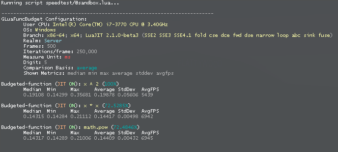

# gluafuncbudget
A utility that serves to conveniently measure performance of functions.

Brief documentation can be found in the code.

The name is coined from an analogy with [Source Engine's Showbudget](https://developer.valvesoftware.com/wiki/Showbudget).

## Mechanism in a nutshell
```
Configure
-> Queue function(-s)
-> 100ms (unique) timer:
	-> Pop function
	-> "Budget" it: TimerCycle() & Call n times & TimerCycle() & Store result

	if last => Finish: Calculate results & Format & Print;
	else: -> Pop function
```

## Example
```lua
gluafuncbudget.Configure( {

	usercpu --[[= nil]];
	usercpu = 'Intel(R) Core(TM) i7-3770 CPU @ 3.40GHz';

	frames --[[= 500]];
	iterations_per_frame --[[= 100000]];
	iterations_per_frame = 250000;

	measure_unit --[[= 'ms']];
	digit --[[= 5]];

	comparison_basis --[[= 'average']];

	shown_metrics --[[= 'median min max average stddev avgfps']];

	jit_off_all --[[= false]];

} )

local g_x = ( 1 + math.sqrt( 5 ) ) / 2
local pow = math.pow
local pre = function( self ) return g_x end

gluafuncbudget.Queue( {

	name = 'x ^ 2';
	standard = true;

	pre = pre;
	main = function( x ) local y = x ^ 2 end;

	--[[boolean]] jit_off;

	--[[function]] post

} )

gluafuncbudget.Queue( {

	name = 'x * x';

	pre = pre;
	main = function( x ) local y = x * x end

} )

gluafuncbudget.Queue( {

	name = 'math.pow';

	pre = pre;
	main = function( x ) local y = pow( x, 2 ) end

} )
```

###### Output


## P.S.
Feel free to use it whenever you need to test a set of functions quickly and descriptively. At times there's irritating need for such convenience (speaking from my own personal experience).

It is yet another tool made for more rapid debugging/development.

As simple as that.
